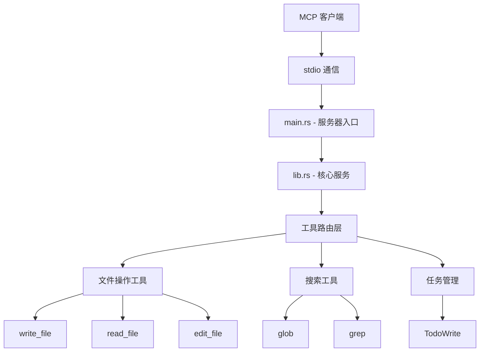

<div align="center">
  <h1>🔧 Windows 文件工具 MCP 服务器</h1>

<p>
    <strong>🏢 专为 Windows 环境打造的下一代企业级文件 MCP 服务器</strong>
  </p>

<p>
    <a href="#-快速开始"></a>
    <a href="#-技术栈"></a>
    <a href="https://github.com/x1t/windows-file-tools-mcp-rust"></a>
    <a href="https://github.com/x1t/windows-file-tools-mcp-rust/issues"></a>
  </p>
</div>

## 📋 目录

- [🚀 项目概述](#-项目概述)
- [✨ 核心功能](#-核心功能)
- [🏗️ 项目架构](#️-项目架构)
- [🛠️ 技术栈](#️-技术栈)
- [🚀 快速开始](#-快速开始)
- [📖 使用示例](#-使用示例)
- [🛡️ 安全特性](#️-安全特性)
- [📚 文档](#-文档)
- [🤝 贡献](#-贡献)
- [📄 许可证](#-许可证)

---

## 🚀 项目概述

<div align="center">

  
  
  

</div>

这是一款使用 **Rust** 实现的高性能、安全的 **MCP（Model Context Protocol）** 服务器，专为 **Windows 系统**设计，提供强大的文件操作和搜索功能。

### 🌟 为什么选择我们？

- ⚡ **极致性能**: 基于 Rust 的零成本抽象和 Tokio 异步运行时
- 🔒 **企业级安全**: 多层安全验证，防止路径遍历和资源滥用
- 🎯 **Windows 原生**: 专为 Windows 环境优化，支持原生路径格式
- 📈 **高并发**: 智能并发控制，最多同时处理 10 个文件操作
- 🔍 **强大搜索**: 集成 ripgrep 核心库，支持复杂正则表达式

---

## ✨ 核心功能

### 📁 文件操作工具

| 功能           | 描述           | 特性                                                          |
| -------------- | -------------- | ------------------------------------------------------------- |
| **写入** | `write_file` | ✅ 自动创建目录`<br>`✅ 原子写入操作`<br>`✅ 详细错误反馈 |
| **读取** | `read_file`  | ✅ 按行读取`<br>`✅ 偏移量和行数限制`<br>`✅ 行号显示     |
| **编辑** | `edit_file`  | ✅ 单次/全部替换`<br>`✅ 安全编辑`<br>`✅ 变更统计        |

### 🔍 搜索工具

| 工具           | 功能     | 输出模式                                                                                                               |
| -------------- | -------- | ---------------------------------------------------------------------------------------------------------------------- |
| **Glob** | `glob` | 📁 文件模式匹配`<br>`🎯 **/*.js 等复杂模式`<br>`⚡ 高性能遍历                                                      |
| **Grep** | `grep` | 📝**content**: 显示匹配内容`<br>`📂 **files_with_matches**: 文件列表`<br>`🔢 **count**: 匹配统计 |

### 📋 任务管理

> **TodoWrite** - 结构化任务列表管理工具，支持状态跟踪和进度可视化

```rust
// 示例任务结构
{
  "content": "实现新的文件搜索功能",
  "status": "in_progress",
  "active_form": "正在实现文件搜索算法"
}
```

---

## 🏗️ 项目架构

<div align="center">



</div>

### 📂 目录结构

```
windows-file-tools-mcp-rust/
├── 📄 src/
│   ├── 🚀 main.rs          # 服务器入口点
│   ├── ⚙️ lib.rs           # 核心服务实现
│   ├── 📂 models/          # 数据结构定义
│   │   ├── 📄 file_ops.rs  # 文件操作模型
│   │   └── 📄 search.rs    # 搜索模型
│   ├── 📂 handlers/        # 请求处理器
│   │   └── 📄 file_handler.rs
│   ├── 📂 tools/           # 工具实现模块
│   │   ├── 🔧 file_tools.rs    # 文件操作工具
│   │   └── 🔍 search_tools.rs  # 搜索工具
│   └── 📂 utils/           # 通用工具函数
│       ├── 🔧 ripgrep_utils.rs
│       └── 📋 fd_utils.rs
├── 📄 Cargo.toml           # 项目配置
├── 📄 CLAUDE.md            # Claude 开发指南
└── 📚 docs/                # 文档目录
    ├── rust-debug_testing_guide.md
    └── rust-stdio-tools.md
```

---

## 🛠️ 技术栈

<div align="center">

| 组件                                                                         | 版本  | 用途         |
| ---------------------------------------------------------------------------- | ----- | ------------ |
|  | 1.70+ | 核心编程语言 |
|          | 1.42  | 异步运行时   |
|               | 0.8.5 | MCP SDK      |
|          | 1.0   | 序列化       |
|      | Core  | 文本搜索     |
|      | 0.1   | 日志记录     |

</div>

---

## 🚀 快速开始

### 📋 系统要求

- **🦀 Rust** 1.70+
- **📦 Cargo** 包管理器
- **🖥️ Windows** 操作系统

### 🔧 安装与构建

<details>
<summary>📦 克隆仓库</summary>

```bash
git clone https://github.com/x1t/windows-file-tools-mcp-rust.git
cd windows-file-tools-mcp-rust
```

</details>

<details>
<summary>🔨 构建项目</summary>

```bash
# 开发模式构建
cargo build

# 生产模式构建（推荐）
cargo build --release
```

</details>

<details>
<summary>🚀 运行服务器</summary>

```bash
# 开发模式运行
cargo run

# 生产模式运行（推荐）
cargo run --release
```

</details>

<details>
<summary>🧪 运行测试</summary>

```bash
# 运行所有测试
cargo test

# 运行特定测试
cargo test test_glob_pattern_matching

# 显示测试详细输出
cargo test -- --nocapture
```

</details>

---

## 📖 使用示例

### 🔧 文件操作

<details>
<summary>📝 写入文件</summary>

```json
{
  "tool": "write_file",
  "arguments": {
    "file_path": "C:\\\\Temp\\\\example.txt",
    "content": "Hello, Windows MCP Server! 🎉"
  }
}
```

</details>

<details>
<summary>📖 读取文件</summary>

```json
{
  "tool": "read_file",
  "arguments": {
    "file_path": "C:\\\\Temp\\\\example.txt",
    "offset": 1,
    "limit": 10
  }
}
```

</details>

<details>
<summary>✏️ 编辑文件</summary>

```json
{
  "tool": "edit_file",
  "arguments": {
    "file_path": "C:\\\\Temp\\\\example.txt",
    "old_string": "Hello",
    "new_string": "Hi",
    "replace_all": true
  }
}
```

</details>

### 🔍 搜索功能

<details>
<summary>🎯 Glob 文件匹配</summary>

```json
{
  "tool": "glob",
  "arguments": {
    "pattern": "**/*.rs",
    "path": "C:\\\\Projects\\\\my-rust-app"
  }
}
```

</details>

<details>
<summary>🔎 Grep 文本搜索</summary>

```json
{
  "tool": "grep",
  "arguments": {
    "pattern": "async fn.*test",
    "path": "src/",
    "output_mode": "content",
    "case_insensitive": true,
    "show_line_numbers": true,
    "before_context": 2,
    "after_context": 2
  }
}
```

</details>

### 📋 任务管理

<details>
<summary>✅ TodoWrite 任务管理</summary>

```json
{
  "tool": "TodoWrite",
  "arguments": {
    "todos": [
      {
        "content": "实现文件搜索功能",
        "status": "completed",
        "active_form": "已完成文件搜索功能实现"
      },
      {
        "content": "添加并发控制",
        "status": "in_progress", 
        "active_form": "正在实现 Semaphore 并发控制"
      },
      {
        "content": "编写单元测试",
        "status": "pending",
        "active_form": "待编写单元测试"
      }
    ]
  }
}
```

</details>

---

### 🔌 MCP 客户端集成

#### 使用 MCP Inspector

```bash
# 启动交互式 MCP 测试环境
npx @modelcontextprotocol/inspector cargo run --release
```

#### 在 Claude Desktop 中使用

```json
{
  "mcpServers": {
    "windows-file-tools": {
      "command": "cargo",
      "args": ["run", "--release", "--manifest-path", "/path/to/Cargo.toml"]
    }
  }
}
```

---

## 🛡️ 安全特性

<div align="center">

| 安全特性               | 描述             | 实现方式               |
| ---------------------- | ---------------- | ---------------------- |
| 🔒**路径验证**   | 防止目录遍历攻击 | 严格的绝对路径检查     |
| 🛡️**输入清理** | 防止恶意输入     | 全面的输入验证和清理   |
| ⚡**资源限制**   | 防止资源滥用     | 并发控制和文件大小限制 |
| 🚫**权限控制**   | 最小权限原则     | 仅必要的文件系统访问   |
| 📝**审计日志**   | 完整的操作记录   | 结构化日志记录         |

</div>

### 🎯 性能优化亮点

- **🔄 智能并发控制**: 最多同时处理 10 个文件，防止资源耗尽
- **📏 动态深度调整**: 根据搜索模式智能调整遍历深度
- **💾 大文件跳过**: 自动跳过超过 10MB 的大文件
- **⚡ 缓存机制**: 路径验证结果缓存，提升重复操作性能

---

## 📚 文档

<div align="center">

| 文档                 | 描述                 | 链接                                                    |
| -------------------- | -------------------- | ------------------------------------------------------- |
| 📖**用户指南** | 完整的使用说明和示例 | [CLAUDE.md](CLAUDE.md)                                     |
| 🐛**调试指南** | 问题诊断和调试技巧   | [rust-debug_testing_guide.md](rust-debug_testing_guide.md) |
| 🔧**工具指南** | stdio 工具详细说明   | [rust-stdio-tools.md](rust-stdio-tools.md)                 |

</div>

---

## 🤝 贡献

<div align="center">

### 🌟 我们欢迎所有形式的贡献！

</div>

#### 🚀 快速贡献流程

```bash
# 1. Fork 并克隆仓库
git clone https://github.com/YOUR_USERNAME/windows-file-tools-mcp-rust.git
cd windows-file-tools-mcp-rust

# 2. 创建功能分支
git checkout -b feature/amazing-feature

# 3. 提交更改
git commit -m '✨ feat: 添加超棒的新功能'

# 4. 推送分支
git push origin feature/amazing-feature

# 5. 创建 Pull Request
```

#### 📋 贡献指南

- 🔍 **Bug 报告**: 请使用 Issue 模板提供详细的重现步骤
- 💡 **功能请求**: 描述使用场景和期望的行为
- 📝 **文档改进**: 修正错别字、改进示例或添加新内容
- 🧪 **测试**: 添加测试用例或改进现有测试
- 🎨 **代码风格**: 遵循 Rust 官方代码规范

---

## 🏆 致谢

<div align="center">

感谢所有为这个项目做出贡献的开发者和用户！ 🙏

特别感谢：

- **MCP 协议团队** - 提供优秀的协议规范
- **Rust 社区** - 提供强大的生态系统
- **ripgrep 团队** - 提供高性能搜索核心

</div>

---

## 📄 许可证

<div align="center">

本项目采用 **MIT 许可证** 开源


</div>

---

## 👥 核心团队

<div align="center">

| 角色                     | 成员          | 联系方式                         |
| ------------------------ | ------------- | -------------------------------- |
| 🏗️**项目架构师** | **x1t** | [📧 x1t@qq.com](mailto:x1t@qq.com)  |
| 💻**核心开发者**   | **x1t** | [🐙 GitHub](https://github.com/x1t) |

</div>

---

## 📞 技术支持

<div align="center">

### 💬 获得帮助

| 渠道                      | 类型         | 响应时间   |
| ------------------------- | ------------ | ---------- |
| 📧**邮箱支持**      | 企业技术支持 | 24-48 小时 |
| 🐛**GitHub Issues** | 公开问题跟踪 | 1-3 天     |
| 📚**文档**          | 自助服务     | 即时       |

</div>

<div align="center">

---

**⭐ 如果这个项目对你有帮助，请给我们一个 Star！**

---

</div>
