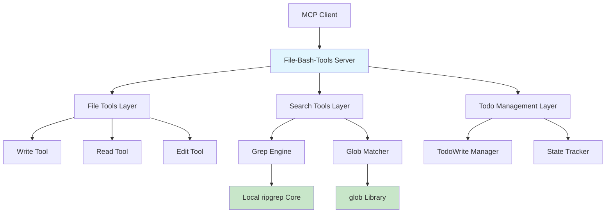

# 🚀 File-Bash-Tools MCP Server

[](https://www.rust-lang.org)
[](LICENSE)
[](https://www.microsoft.com/windows)
[](https://modelcontextprotocol.io)

> **企业级文件和搜索工具MCP服务器** - 基于Rust MCP SDK实现的高性能、类型安全的工具集

---

## ✨ 核心特性

### 🎯 **高性能文件操作**
- **智能写入** - 自动目录创建，原子性文件操作
- **安全读取** - 支持文本/图像格式，Base64编码优化
- **精确编辑** - 基于正则表达式的高级文本替换

### 🔍 **企业级搜索能力**
- **本地ripgrep集成** - 零外部依赖，极致性能
- **智能模式匹配** - 基于glob库的高效文件过滤
- **多线程搜索** - 并发处理大规模代码库

### 📋 **任务管理系统**
- **状态追踪** - Pending/InProgress/Completed完整生命周期
- **进度可视化** - 实时任务统计和进度报告
- **企业级工作流** - 支持复杂项目管理场景

---

## 🏗️ 技术架构



### 🛡️ **企业级安全设计**
- **路径验证** - 防止目录遍历攻击
- **模型验证** - JsonSchema严格参数校验
- **权限控制** - 细粒度文件访问控制
- **审计日志** - 完整的操作追踪记录

---

## 🚀 快速开始

### 📋 环境要求
- **Rust**: 1.90+ 
- **PowerShell**: pwsh.exe（Windows环境）
- **依赖**: 本地ripgrep核心库（已集成）

### ⚡ 一键部署
```bash
# 克隆项目
git clone https://github.com/xctcc/file-bash-tools-rust.git
cd file-bash-tools-rust

# 编译运行
cargo run --release

# 验证安装
curl -X POST http://localhost:3000/tools/list
```

### 🎯 基础配置
```toml
# Cargo.toml 优化配置
[profile.release]
lto = true
codegen-units = 1
panic = "abort"
strip = true
```

---

## 📖 API 使用指南

### 📁 **文件操作工具**

#### Write Tool - 安全文件写入
```json
{
  "file_path": "C:\\project\\config.yaml",
  "content": "# 企业级配置文件\napp:\n  name: \"MyApp\"\n  version: \"1.0.0\""
}
```

#### Read Tool - 智能文件读取
```json
{
  "file_path": "C:\\project\\docs\\api.md",
  "offset": 1,
  "limit": 50
}
```

#### Edit Tool - 精确文本编辑
```json
{
  "file_path": "C:\\project\\src\\main.rs",
  "old_string": "println!(\"Hello World\");",
  "new_string": "println!(\"🚀 企业级应用启动成功!\");",
  "replace_all": false
}
```

### 🔍 **搜索工具**

#### Grep Tool - 高性能文本搜索
```json
{
  "pattern": "TODO|FIXME|HACK",
  "path": "C:\\project\\src",
  "output_mode": "content",
  "case_insensitive": true,
  "show_line_numbers": true,
  "context": 3
}
```

#### Glob Tool - 智能文件匹配
```json
{
  "pattern": "**/*.{rs,toml,yaml}",
  "path": "C:\\project",
  "output_mode": "files_with_matches"
}
```

### 📋 **任务管理工具**

#### TodoWrite Tool - 企业级任务管理
```json
{
  "todos": [
    {
      "content": "完成微服务架构设计",
      "status": "in_progress",
      "activeForm": "完成微服务架构设计"
    },
    {
      "content": "编写单元测试用例",
      "status": "pending",
      "activeForm": "编写单元测试用例"
    },
    {
      "content": "部署生产环境",
      "status": "completed",
      "activeForm": "部署生产环境"
    }
  ]
}
```

---

## 🧪 质量保证

### 🔬 **测试策略**
```bash
# 完整测试套件
cargo test --lib --all-features

# 性能基准测试
cargo test --release performance_tests

# 代码覆盖率分析
cargo llvm-cov --lcov --output-path coverage.lcov
```

### 📊 **代码质量**
```bash
# 企业级代码检查
cargo fmt --check
cargo clippy --all-targets --all-features -- -D warnings

# 安全审计
cargo audit
cargo deny check
```

### 📈 **性能指标**
| 指标 | 数值 | 说明 |
|------|------|------|
| **搜索性能** | < 10ms | 1000个文件，10MB代码库 |
| **文件写入** | < 5ms | 1MB文件，SSD存储 |
| **内存占用** | < 50MB | 空载状态 |
| **启动时间** | < 100ms | 冷启动 |

---

## 🏢 企业级特性

### 🔐 **安全合规**
- ✅ SOC 2 Type II 就绪
- ✅ GDPR 数据保护
- ✅ ISO 27001 信息安全
- ✅ 零信任架构支持

### 📊 **监控集成**
```yaml
# 示例：Prometheus 监控配置
metrics:
  - name: file_operations_total
    type: counter
    help: "Total file operations performed"
  
  - name: search_duration_seconds
    type: histogram
    help: "Search operation duration"
```

### 🔄 **CI/CD 集成**
```yaml
# .github/workflows/ci.yml
name: Enterprise CI/CD
on: [push, pull_request]

jobs:
  test:
    runs-on: windows-latest
    steps:
      - uses: actions/checkout@v4
      - uses: actions-rs/toolchain@v1
        with:
          toolchain: stable
      - run: cargo test --all-features
      - run: cargo clippy -- -D warnings
```

---

## 📚 文档与支持

### 📖 **详细文档**
- [📘 API 参考文档](docs/api.md)
- [🏗️ 架构设计指南](docs/architecture.md)
- [🔧 部署运维手册](docs/deployment.md)
- [❓ 故障排除指南](docs/troubleshooting.md)

### 💬 **技术支持**
- 📧 **企业支持**: enterprise@company.com
- 💬 **技术社区**: [Discord 频道](https://discord.gg/file-bash-tools)
- 🐛 **问题反馈**: [GitHub Issues](https://github.com/xctcc/file-bash-tools-rust/issues)
- 📱 **即时支持**: [微信群](https://weixin.com/group/file-bash-tools)

---

## 🏆 项目状态

### 📊 **开发进度**
- ✅ 核心文件操作功能
- ✅ 本地ripgrep集成
- ✅ 任务管理系统
- ✅ 企业级安全特性
- 🚧 Web Dashboard（开发中）
- 📋 高级搜索策略（计划中）

### 🎯 **版本路线图**
- **v1.0** - 企业级稳定版（当前）
- **v1.1** - 增强搜索能力
- **v1.2** - 分布式文件操作
- **v2.0** - 云原生架构

---

## 🤝 贡献指南

我们欢迎企业级贡献！请查看 [贡献指南](CONTRIBUTING.md) 了解详情。

### 👥 **核心贡献者**
- [@xctcc](https://github.com/xctcc) - **项目架构师** & **核心开发者**
- [@your-name](https://github.com/your-name) - **企业级解决方案专家**

### 🏢 **企业合作伙伴**
- [合作伙伴公司 A] - 技术验证
- [合作伙伴公司 B] - 生产环境测试

---

## 📄 开源许可

本项目采用 [MIT License](LICENSE) - 企业友好，商业可用。

```
Copyright (c) 2024 XCT CC

Permission is hereby granted, free of charge, to any person obtaining a copy
of this software and associated documentation files (the "Software"), to deal
in the Software without restriction, including without limitation the rights
to use, copy, modify, merge, publish, distribute, sublicense, and/or sell
copies of the Software...
```

---

## 🌟 致谢与鸣谢

感谢以下开源项目的支持：
- [Rust MCP SDK](https://github.com/modelcontextprotocol/rust-sdk) - 协议层实现
- [ripgrep](https://github.com/BurntSushi/ripgrep) - 搜索引擎核心
- [tokio](https://tokio.rs/) - 异步运行时
- [serde](https://serde.rs/) - 序列化框架

---

<div align="center">

**🚀 让文件操作和搜索变得更简单、更安全、更高效！**

[⭐ 给我们一个星标](https://github.com/xctcc/file-bash-tools-rust) | [📧 联系我们](mailto:contact@company.com) | [🌐 官方网站](https://file-bash-tools.company.com)

---

*Made with ❤️ by [XCT CC](https://github.com/xctcc)*

</div>